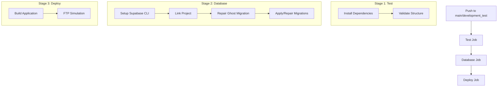

# Atlas Robotics - Production Website


## 🚀 Automated Deployment Pipeline

This project features a sophisticated 3-stage deployment pipeline using GitHub Actions, designed for reliable and consistent deployments across different environments.

### Pipeline Architecture



## 📋 Deployment Stages

### Stage 1: Test & Validation
- **Purpose**: Validates project structure and dependencies
- **Actions**:
  - Installs npm dependencies
  - Validates project structure
  - Ensures build prerequisites are met
- **Environment**: Uses configured GitHub environment for approval gates

### Stage 2: Database Management
- **Purpose**: Handles Supabase database migrations and repairs
- **Actions**:
  - Links to Supabase project
  - **Ghost Migration Repair**: Automatically reverts problematic migration `20250620120922`
  - **Auto-Repair System**: Detects migration mismatches and repairs them
  - Synchronizes local schema with remote database
  - Applies pending migrations
- **Environment**: Full Supabase environment variables required

### Stage 3: Application Deployment
- **Purpose**: Builds and deploys the application
- **Actions**:
  - Builds the Vite React application
  - Simulates FTP deployment (ready for real FTP integration)
  - Confirms deployment success
- **Environment**: Uses production/development variables

## 🔧 Environment Configuration

### GitHub Environments

The workflow uses two GitHub environments:
- **`production`**: Triggered by pushes to `main` branch
- **`development-test`**: Triggered by pushes to `development_test` branch

### Required Environment Variables

Add these in GitHub Settings → Environments → [Your Environment] → Environment variables:

| Variable | Description | Example |
|----------|-------------|---------|
| `SUPABASE_PROJECT_REF` | Your Supabase project reference ID | `abc123def456` |
| `SUPABASE_URL` | Your Supabase project URL | `https://abc123def456.supabase.co` |

### Required Environment Secrets

Add these in GitHub Settings → Environments → [Your Environment] → Environment secrets:

| Secret | Description | Where to Find |
|--------|-------------|---------------|
| `SUPABASE_ACCESS_TOKEN` | Supabase CLI access token | [Supabase Dashboard → Settings → Access Tokens](https://supabase.com/dashboard/account/tokens) |
| `SUPABASE_ANON_KEY` | Supabase anonymous key | Supabase Dashboard → Settings → API |
| `SUPABASE_SERVICE_ROLE_KEY` | Supabase service role key | Supabase Dashboard → Settings → API |
| `SUPABASE_DB_PASSWORD` | Database password | Set during Supabase project creation |

## 🛡️ Environment Protection & Reviews

### Setting Up Environment Reviews

1. Go to **Settings** → **Environments** → **[Environment Name]**
2. Enable **Required reviewers**
3. Add team members who can approve deployments
4. Configure **Deployment protection rules**

### Review Process

When a deployment is triggered:
1. Workflow pauses at environment gate
2. Configured reviewers receive notification
3. Reviewers can view changes and approve/reject
4. Upon approval, deployment continues
5. Deployment status updates in real-time

### Approving Deployments

1. Navigate to **Actions** tab in your repository
2. Find the pending workflow run
3. Click **Review deployments**
4. Select environments to approve
5. Add optional comment
6. Click **Approve and deploy**

## 🔄 Deployment Triggers

### Automatic Deployments
- **Production**: Triggered by any push to `main` branch
- **Development**: Triggered by any push to `development_test` branch

### Manual Deployments
Use GitHub's workflow dispatch feature:
1. Go to **Actions** → **Deploy Application**
2. Click **Run workflow**
3. Select branch and environment
4. Click **Run workflow**

## 🗄️ Database Migration Management

### Ghost Migration Handling
The pipeline automatically handles a known problematic migration:
- **Migration ID**: `20250620120922`
- **Action**: Automatically reverted on each deployment
- **Reason**: Prevents deployment conflicts

### Auto-Repair System
When migration mismatches occur:
1. **Detection**: Pipeline detects `supabase db push` failures
2. **Schema Sync**: Pulls latest schema from remote database
3. **Local Repair**: Marks all local migrations as applied
4. **Retry**: Attempts push operation again
5. **Validation**: Confirms successful migration

### Migration Best Practices
- Always test migrations in development environment first
- Use descriptive migration names
- Avoid breaking changes in production migrations
- Monitor migration logs during deployment

## 📁 FTP Deployment Simulation

### Current Implementation
- **Script**: `scripts/simulate-ftp-deploy.ps1`
- **Action**: Creates local directory structure mimicking FTP deployment
- **Location**: `C:\DeploySimulation\[environment]`

### Upgrading to Real FTP
To implement actual FTP deployment, replace the simulation step with:
```yaml
- name: Deploy via FTP
  uses: SamKirkland/FTP-Deploy-Action@4.3.3
  with:
    server: ${{ secrets.FTP_SERVER }}
    username: ${{ secrets.FTP_USERNAME }}
    password: ${{ secrets.FTP_PASSWORD }}
    local-dir: ./dist/
```

## 🔍 Troubleshooting

### Common Issues

#### Migration Conflicts
**Symptoms**: `supabase db push` fails with migration mismatch
**Solution**: The auto-repair system handles this automatically

#### Environment Variables Missing
**Symptoms**: Job fails with undefined variable errors
**Solution**: Verify all required variables and secrets are configured in GitHub environment settings

#### Database Connection Issues
**Symptoms**: Cannot link to Supabase project
**Solutions**:
- Verify `SUPABASE_PROJECT_REF` is correct
- Check `SUPABASE_DB_PASSWORD` matches your project
- Ensure `SUPABASE_ACCESS_TOKEN` has proper permissions

#### Build Failures
**Symptoms**: `npm run build` fails
**Solutions**:
- Check for TypeScript errors in logs
- Verify all dependencies are properly installed
- Ensure environment variables for Vite are correctly set

### Debug Steps

1. **Check Workflow Logs**:
   - Go to Actions tab
   - Click on failed workflow
   - Expand failed job steps
   - Review detailed logs

2. **Test Locally**:
   ```bash
   npm ci
   npm run build
   ```

3. **Verify Environment Setup**:
   - Check GitHub environment configuration
   - Validate all secrets and variables are present
   - Test Supabase connection locally

### Recovery Procedures

#### Failed Database Migration
1. Check migration logs in workflow output
2. If ghost migration issues persist, manually run:
   ```bash
   supabase migration repair --status reverted 20250620120922
   ```
3. Re-run the workflow

#### Failed Deployment
1. Check build logs for specific errors
2. Verify FTP simulation script permissions
3. Re-run workflow after fixing issues

## 🏗️ Development Workflow

### Branch Strategy
- **`main`**: Production-ready code, triggers production deployment
- **`development_test`**: Development code, triggers development deployment
- **Feature branches**: Create PRs to `development_test` for testing

### Local Development
```bash
# Clone repository
git clone <your-repo-url>
cd <your-project>

# Install dependencies
npm install

# Start development server
npm run dev

# Build for production
npm run build
```

### Integration with GitHub Actions
- All pushes to tracked branches trigger automatic deployments
- PR merges automatically deploy to appropriate environments
- Manual deployments available via GitHub Actions interface

## 📊 Monitoring & Logs

### Deployment Status
- **Badge**: Shows current deployment status in README
- **Actions Tab**: Detailed workflow history and logs
- **Environment Status**: Real-time deployment status per environment

### Log Access
- **Workflow Logs**: Available in GitHub Actions tab
- **Supabase Logs**: Available in Supabase Dashboard
- **Build Logs**: Included in workflow output

## 🚀 Technologies Used

This project is built with:
- **Frontend**: Vite + React + TypeScript
- **Styling**: Tailwind CSS + shadcn-ui
- **Backend**: Supabase (Database, Auth, Storage)
- **Deployment**: GitHub Actions + FTP Simulation
- **Database**: PostgreSQL (via Supabase)

## 📝 Project Info

**Lovable Project URL**: https://lovable.dev/projects/35d72d2e-6e25-40e5-9b0c-c0d1a7c1b727

## 🔗 Quick Links

- [GitHub Actions Documentation](https://docs.github.com/en/actions)
- [Supabase Documentation](https://supabase.com/docs)
- [Environment Protection Rules](https://docs.github.com/en/actions/deployment/targeting-different-environments/using-environments-for-deployment#environment-protection-rules)

---

## Local Development Setup

If you want to work locally using your own IDE:

### Prerequisites
- Node.js & npm installed ([install with nvm](https://github.com/nvm-sh/nvm#installing-and-updating))

### Setup Steps
```sh
# Step 1: Clone the repository
git clone <YOUR_GIT_URL>

# Step 2: Navigate to the project directory
cd <YOUR_PROJECT_NAME>

# Step 3: Install dependencies
npm i

# Step 4: Start development server
npm run dev
```

### Alternative Development Methods

- **Lovable Editor**: Visit the [Lovable Project](https://lovable.dev/projects/35d72d2e-6e25-40e5-9b0c-c0d1a7c1b727) for AI-assisted development
- **GitHub Codespaces**: Use cloud development environment
- **Direct GitHub Editing**: Edit files directly in GitHub interface

## 🌐 Deployment Options

### Lovable Hosting
- **Quick Deploy**: Use Lovable's Share → Publish feature
- **Custom Domain**: Available with paid Lovable plans

### Self-Hosting
After connecting to GitHub, deploy anywhere:
- Netlify, Vercel, or similar platforms
- Your own server infrastructure
- Configure environment variables in your hosting platform

For custom domains on self-hosted deployments, see: [Custom Domain Documentation](https://docs.lovable.dev/tips-tricks/custom-domain/)

